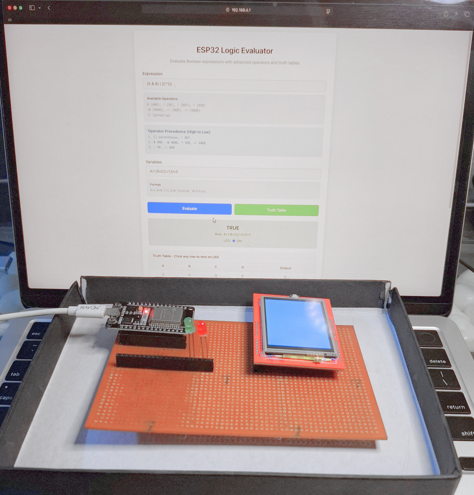
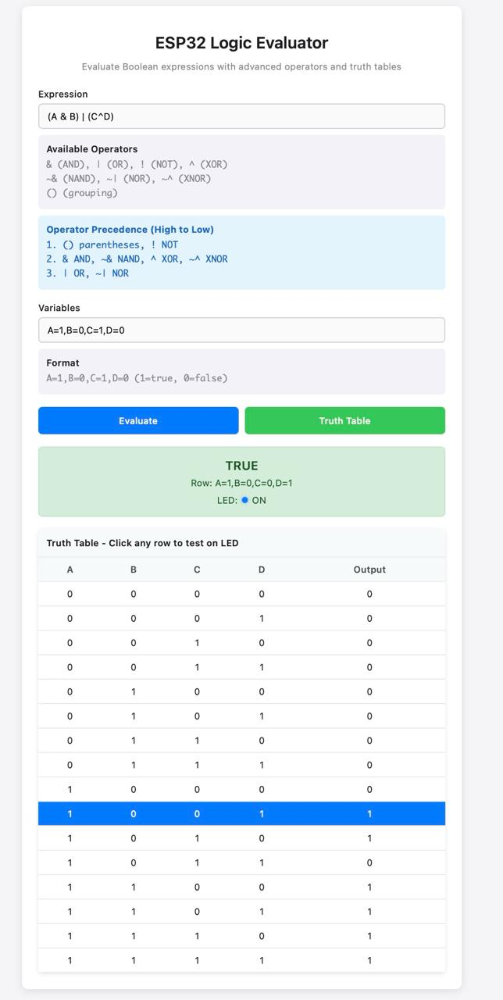
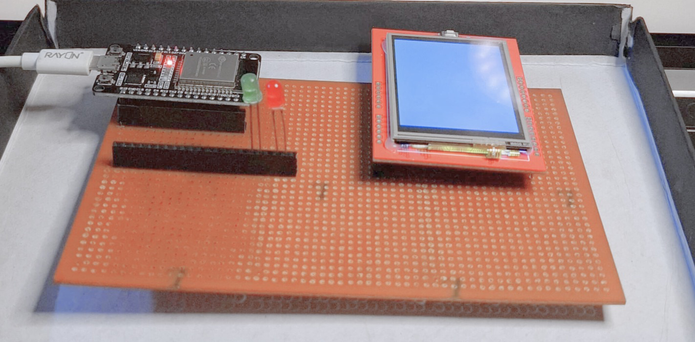

# ESP32 Logic Evaluator with Display & Web Interface

<div align="center">

## Project based on IEC121	Digital Design and Electric Circuits,IEC213	Microprocessors and Microcontrollers

**A comprehensive Boolean logic evaluation system with web interface, TFT display, and dual LED indicators**



[](https://www.espressif.com/en/products/socs/esp32)
[](https://www.arduino.cc/)
[](LICENSE)

</div>

## 📋 Table of Contents

- [🎯 Features](#-features)
- [📦 Hardware Requirements](#-hardware-requirements)
- [⚡ Quick Start](#-quick-start)
- [🔧 Installation](#-installation)
- [🎮 Usage](#-usage)
- [🔍 Supported Operations](#-supported-operations)
- [🌐 API Reference](#-api-reference)
- [🐛 Troubleshooting](#-troubleshooting)
- [📊 Technical Specifications](#-technical-specifications)
- [🤝 Contributing](#-contributing)
- [📄 License](#-license)

## 🎯 Features

<div align="center">





*Web Interface - Boolean expression evaluation with real-time feedback*

</div>

### 🌟 Core Features

- **🌐 Web Interface**: Complete web-based logic evaluator accessible via WiFi
- **📱 Local Display**: 2.4-inch TFT screen showing current expression and results
- **💡 Dual LED Indicators**: Red LED for FALSE, Green LED for TRUE
- **🧮 Advanced Logic Operations**: Support for AND, OR, NOT, XOR, NAND, NOR, XNOR
- **📊 Truth Table Generation**: Interactive truth tables with LED testing
- **⚡ Real-time Evaluation**: Instant feedback on expression changes
- **🎯 Hardware Integration**: Seamless connection between web interface and hardware

### 🔧 Advanced Features

- **Operator Precedence**: Proper mathematical operator precedence handling
- **Expression Validation**: Real-time syntax checking and error reporting
- **Interactive Truth Tables**: Click-to-test functionality for each truth table row
- **Responsive Design**: Mobile-friendly web interface
- **Hardware Status**: Real-time hardware status monitoring

## 📦 Hardware Requirements

<div align="center">



*Complete hardware setup with ESP32, display, and LEDs*


</div>

### 🛠️ Required Components

| Component | Specification | Quantity |
|-----------|---------------|----------|
| ESP32 Development Board | Any ESP32 variant | 1 |
| TFT Display | 2.4" ILI9341 or compatible | 1 |
| Red LED | 5mm, 20mA | 1 |
| Green LED | 5mm, 20mA | 1 |
| Resistors | 220Ω, 1/4W | 2 |
| Breadboard/PCB | Custom PCB recommended | 1 |
| Jumper Wires | Male-to-male | 10+ |

### 🔌 Pin Configuration

```
📺 Display (SPI Interface):
┌─────────────────────────────────┐
│ Display Pin │ ESP32 GPIO │ Notes │
├─────────────┼────────────┼───────┤
│ VCC         │ 3.3V       │ Power │
│ GND         │ GND        │ Ground│
│ CS          │ GPIO 15    │ SPI   │
│ RESET       │ GPIO 2     │ Reset │
│ DC          │ GPIO 4     │ Data  │
│ MOSI        │ GPIO 23    │ SPI   │
│ SCK         │ GPIO 18    │ Clock │
│ LED         │ 3.3V       │ Backlight│
│ MISO        │ GPIO 19    │ SPI   │
└─────────────┴────────────┴───────┘

💡 LEDs:
┌─────────────────────────────────┐
│ Component   │ ESP32 GPIO │ Notes │
├─────────────┼────────────┼───────┤
│ Red LED     │ GPIO 25    │ FALSE │
│ Green LED   │ GPIO 26    │ TRUE  │
└─────────────┴────────────┴───────┘
```

## ⚡ Quick Start

### 1️⃣ Hardware Setup
```bash
# Connect display and LEDs according to pin configuration
# Ensure all connections are secure and properly oriented
```

### 2️⃣ Software Installation
```bash
# Install Arduino IDE
# Install required libraries: TFT_eSPI, WiFi, WebServer
# Configure TFT_eSPI library settings
```

### 3️⃣ Upload Code
```bash
# Upload logic_evaluator.ino to ESP32
# Monitor serial output for WiFi credentials
```

### 4️⃣ Connect and Use
```bash
# Connect to "LogicEvaluator" WiFi network
# Password: logic123
# Open browser to IP address shown on display
```

## 🔧 Installation

### 📚 Arduino IDE Libraries

Install these libraries via Library Manager:

```cpp
// Required Libraries
TFT_eSPI by Bodmer    // For display control
WiFi                  // Built-in ESP32 library
WebServer            // Built-in ESP32 library
```

### ⚙️ TFT_eSPI Configuration

Create or modify `User_Setup.h` in the TFT_eSPI library folder:

```cpp
// Display Driver Configuration
#define ILI9341_DRIVER

// Pin Definitions
#define TFT_MISO 19
#define TFT_MOSI 23
#define TFT_SCLK 18
#define TFT_CS   15
#define TFT_DC   4
#define TFT_RST  2

// Font Support
#define LOAD_GLCD
#define LOAD_FONT2
#define LOAD_FONT4
#define LOAD_FONT6
#define LOAD_FONT7
#define LOAD_FONT8
#define LOAD_GFXFF
#define SMOOTH_FONT

// Performance Settings
#define SPI_FREQUENCY  40000000
```

### 🔄 Step-by-Step Installation

1. **Hardware Assembly**
   ```bash
   ✅ Connect display using SPI interface
   ✅ Connect LEDs with 220Ω resistors
   ✅ Double-check all connections
   ✅ Power on and test basic functionality
   ```

2. **Software Setup**
   ```bash
   ✅ Install Arduino IDE
   ✅ Add ESP32 board support
   ✅ Install TFT_eSPI library
   ✅ Configure User_Setup.h
   ```

3. **Code Upload**
   ```bash
   ✅ Open logic_evaluator.ino
   ✅ Select ESP32 board type
   ✅ Choose correct COM port
   ✅ Upload code and monitor serial output
   ```

## 🎮 Usage

### 🌐 Web Interface

1. **Connect to WiFi**
   ```
   Network: LogicEvaluator
   Password: logic123
   ```

2. **Access Web Interface**
   ```
   URL: http://[IP_ADDRESS]
   (IP shown on display)
   ```

3. **Enter Boolean Expression**
   ```
   Example: !(A & B) | (C ^ D)
   ```

4. **Set Variable Values**
   ```
   Format: A=1,B=0,C=1,D=0
   ```

5. **Evaluate or Generate Truth Table**
   ```
   Click "Evaluate" for single result
   Click "Truth Table" for complete analysis
   ```

### 📺 Local Display Interface

- **Real-time Results**: View current expression and evaluation results
- **LED Status**: Visual indication of TRUE/FALSE states
- **Truth Table Display**: Complete truth table visualization
- **Hardware Status**: Connection and component status

### 📊 Example Usage

```javascript
// Example 1: Basic Logic Operations
Expression: A & B
Variables: A=1,B=1
Result: TRUE (Green LED)

// Example 2: Complex Expression
Expression: (A | B) & !C
Variables: A=0,B=1,C=0
Result: TRUE (Green LED)

// Example 3: Advanced Operations
Expression: ~^(A & B, C | D)
Variables: A=1,B=1,C=0,D=1
Result: FALSE (Red LED)
```

## 🔍 Supported Operations

### 🔧 Basic Operators

| Operator | Symbol | Description | Example |
|----------|--------|-------------|---------|
| AND | `&` | Logical AND | `A & B` |
| OR | `|` | Logical OR | `A | B` |
| NOT | `!` | Logical NOT | `!A` |
| XOR | `^` | Exclusive OR | `A ^ B` |

### 🚀 Advanced Operators

| Operator | Symbol | Description | Example |
|----------|--------|-------------|---------|
| NAND | `~&` | NOT AND | `~&(A,B)` |
| NOR | `~|` | NOT OR | `~|(A,B)` |
| XNOR | `~^` | NOT XOR | `~^(A,B)` |

### 📈 Operator Precedence (High to Low)

1. **Parentheses & NOT**: `()`, `!`
2. **AND & XOR Group**: `&`, `~&`, `^`, `~^`
3. **OR Group**: `|`, `~|`

### 💡 Expression Examples

```cpp
// Basic Examples
!(A & B)           // NOT (A AND B)
A | B              // A OR B
A ^ B              // A XOR B

// Advanced Examples
~&(A,B)            // A NAND B
(A | B) & !C       // (A OR B) AND NOT C
~^(A & B, C | D)   // (A AND B) XNOR (C OR D)

// Complex Expressions
!((A & B) | (C ^ D)) & (E | !F)
(A & B) | (C & D) | (E & F)
```

## 🌐 API Reference

### 🔗 Endpoints

| Method | Endpoint | Description | Parameters |
|--------|----------|-------------|------------|
| GET | `/` | Main web interface | None |
| POST | `/evaluate` | Evaluate expression | `expression`, `variables` |
| POST | `/truthtable` | Generate truth table | `expression` |
| POST | `/testrow` | Test truth table row | `variables` |
| GET | `/status` | Get current status | None |

### 📝 Request/Response Examples

```javascript
// Evaluate Expression
POST /evaluate
{
  "expression": "A & B",
  "variables": "A=1,B=0"
}

// Response
{
  "result": false,
  "expression": "A & B",
  "variables": "A=1,B=0",
  "led": "RED"
}
```

## 🐛 Troubleshooting

### 📺 Display Issues

| Problem | Solution |
|---------|----------|
| Display not working | Check SPI connections and power supply |
| Garbled display | Verify TFT_eSPI configuration |
| No backlight | Check LED pin connection (3.3V) |

### 🌐 WiFi Connection Issues

| Problem | Solution |
|---------|----------|
| Cannot connect to WiFi | Check ESP32 is in AP mode |
| Wrong password | Use "logic123" |
| IP not showing | Check serial monitor output |

### 💡 LED Issues

| Problem | Solution |
|---------|----------|
| LEDs not lighting | Check polarity and resistor values |
| Dim LEDs | Verify 220Ω resistors are used |
| Only one LED works | Check GPIO pin connections |

### 🔧 Expression Evaluation Issues

| Problem | Solution |
|---------|----------|
| Syntax error | Check operator precedence and parentheses |
| Wrong result | Verify variable format (A=1,B=0) |
| Expression not parsing | Use supported operators only |

## 📊 Technical Specifications

### 💾 Memory Usage

| Component | Usage | Limit |
|-----------|--------|-------|
| Program Storage | ~150KB | 4MB |
| Dynamic Memory | ~20KB | 320KB |
| Truth Table | 8 variables | 256 rows max |

### ⚡ Performance

| Operation | Time | Notes |
|-----------|------|-------|
| Expression Evaluation | <1ms | Single evaluation |
| Truth Table Generation | <100ms | 4 variables |
| Web Response | <50ms | Network dependent |

### 🔧 Hardware Specifications

| Parameter | Value | Notes |
|-----------|-------|-------|
| Operating Voltage | 3.3V | ESP32 standard |
| Display Resolution | 320x240 | 2.4" TFT |
| LED Current | 20mA | Per LED |
| WiFi Range | 50m | Indoor typical |

## 🤝 Contributing

We welcome contributions! Here's how to get started:

### 🚀 Getting Started

1. **Fork the repository**
2. **Create a feature branch**
   ```bash
   git checkout -b feature/amazing-feature
   ```
3. **Make your changes**
4. **Test thoroughly**
5. **Submit a pull request**

### 📋 Contribution Guidelines

- Follow existing code style
- Add comments for complex logic
- Test on actual hardware
- Update documentation
- Add example expressions

### 🔍 Areas for Contribution

- [ ] Additional operators (IMPLIES, EQUIV)
- [ ] Touch screen interface
- [ ] Expression history
- [ ] Export functionality
- [ ] Mobile app integration

## 📄 License

This project is licensed under the MIT License - see the [LICENSE](LICENSE) file for details.

## 🙏 Acknowledgments

- [Bodmer](https://github.com/Bodmer) for the excellent TFT_eSPI library
- [Espressif](https://www.espressif.com/) for the ESP32 platform
- Community contributors and testers

---

<div align="center">

**Made with ❤️ by [Adithya R Prabhu](https://github.com/adithya-r-prabhu)**

*If this project helped you, please consider giving it a ⭐!*

</div>
